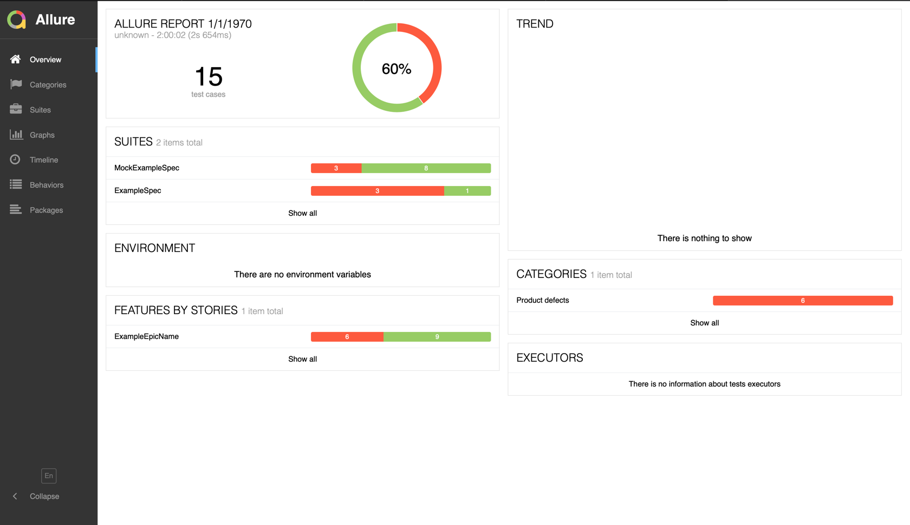
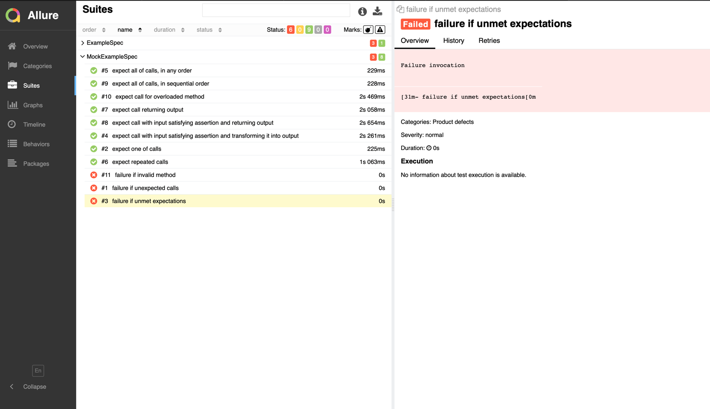

# Allure ZIO Test


[](http://isitmaintained.com/project/Cronenberg-world/allure-zio-test "Average time to resolve an issue")
[](http://isitmaintained.com/project/Cronenberg-world/allure-zio-test "Percentage of issues still open")
[](https://javadoc.io/doc/io.cronenbergworld/allure-zio-core_2.13)
[](https://index.scala-lang.org/cronenberg-world/allure-zio-test/allure-zio-test)
[](https://gitpod.io/#https://github.com/Cronenberg-World/allure-zio-test)


## Download

You can use one of the following ways to get Allure:

* Grab it from [bintray](https://bintray.com/qameta/maven/allure2) (see Downloads section).
* Using Homebrew:

```bash
brew install allure
```

* For Windows, Allure is available from the [Scoop](http://scoop.sh/) commandline-installer.
  To install Allure, download and install Scoop and then execute in the Powershell:

```bash
scoop install allure
```

## Usage API in ZIO/Scala project

Add Allure plugin to project

In `project/plugin.sbt` file add the next line

```sbt
addSbtPlugin("io.cronenbergworld" % "allure-zio-plugin" % "<last-version>")
```

Enable this plugin by adding the next line in `build.sbt` file

```sbt
enablePlugins(AllureAutoPlugin)
```

```scala
import zio.test._
import zio.test.allure.AllureRunnableSpec
import zio.test.allure.Tags._

object ExampleSpec extends AllureRunnableSpec {

  def spec = suite("some suite")(
    test("failing test") {
      val stuff = 1
      assert(stuff)(Assertion.equalTo(2))
    } @@ owner("ExampleOwner") @@ custom("google.com", "google.com"),
    test("failing test 2") {
      val stuff = Some(1)
      assert(stuff)(Assertion.isSome(Assertion.equalTo(2)))
    },
    test("failing test 3") {
      val stuff = Some(1)
      assert(stuff)(Assertion.isSome(Assertion.not(Assertion.equalTo(1))))
    },
    test("passing test") {
      assert(1)(Assertion.equalTo(1))
    }
  ) @@ epic("ExampleEpicName")
}

```

You need to use `zio.test.allure.AllureRunnableSpec` instead of `zio.test.DefaultRunnableSpec`

## Get Allure Report

If you want to generate report and up the server you need to use

```bash
allure serve allure-results
```

For generate HTML report use

```bash
allure generate allure-results
```

## Demo



